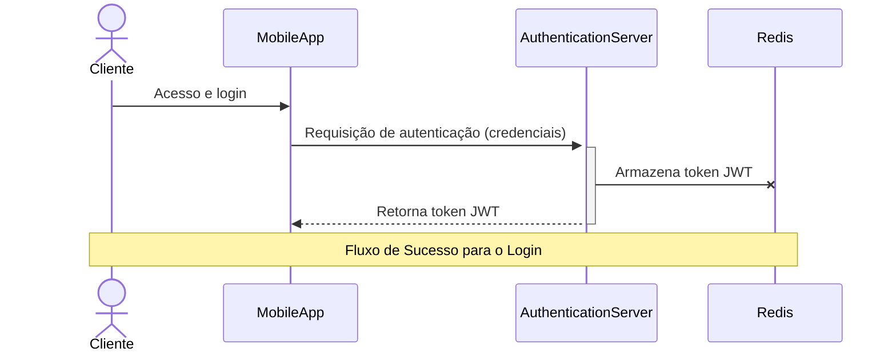
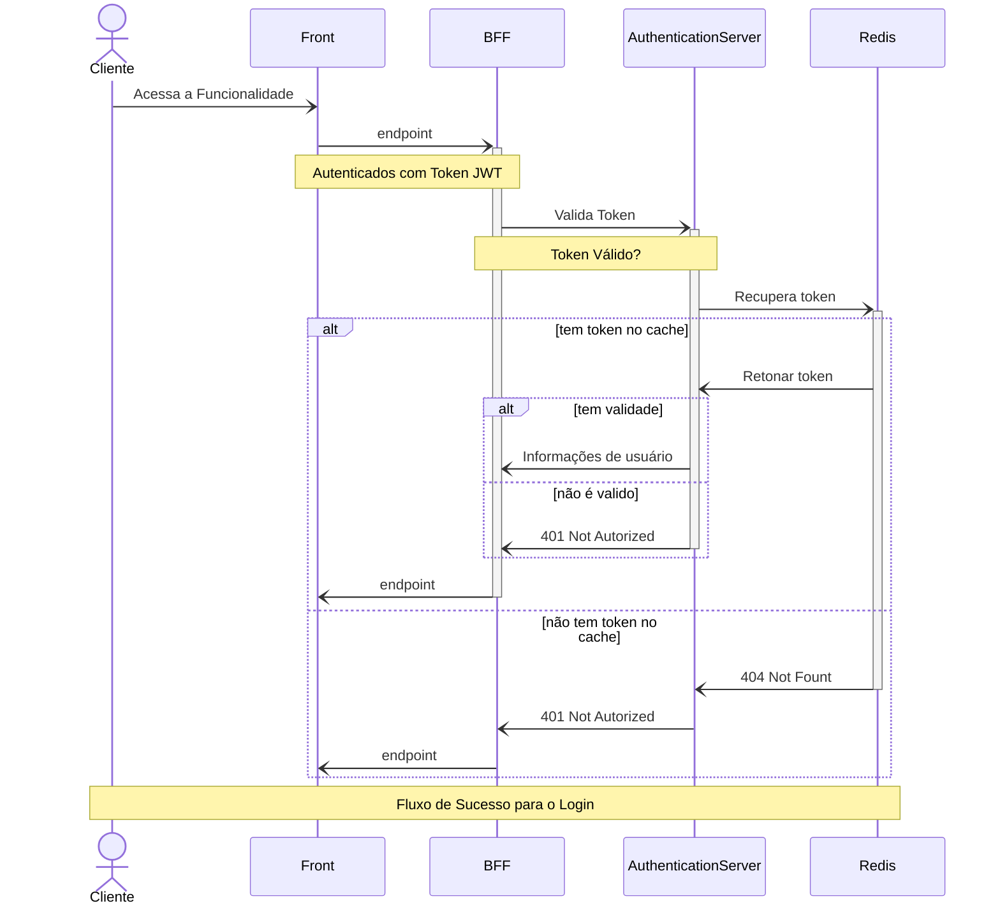

# arch-solution
### Project

### Solution Architecture
`Process for user login`

```mermaid
sequenceDiagram
    actor Cliente
    participant MobileApp
    participant AuthenticationServer
    participant Redis

    Cliente->>MobileApp: Acesso e login
    MobileApp->>+AuthenticationServer: Requisição de autenticação (credenciais)
    activate AuthenticationServer
    AuthenticationServer-xRedis: Armazena token JWT
    AuthenticationServer-->>-MobileApp: Retorna token JWT

    Note over Cliente, Redis: Fluxo de Sucesso para o Login
```

`Process for token validation`

```mermaid
sequenceDiagram
    actor Cliente
    participant Front
    participant BFF
    participant AuthenticationServer
    participant Redis

    Cliente -)Front: Acessa a Funcionalidade
    Front-)+BFF: endpoint
    Note over Front,BFF: Autenticados com Token JWT
    BFF-)+AuthenticationServer: Valida Token
    Note over BFF,AuthenticationServer: Token Válido?
    AuthenticationServer-)+Redis: Recupera token
    alt tem token no cache
        Redis-)AuthenticationServer: Retonar token
        alt tem validade
            AuthenticationServer-)BFF: Informações de usuário
        else não é valido
            AuthenticationServer-)-BFF: 401 Not Autorized
        end        
        BFF-)-Front: endpoint
    else não tem token no cache
        Redis-)-AuthenticationServer: 404 Not Fount
        AuthenticationServer-)BFF: 401 Not Autorized   
        BFF-)Front: endpoint
    end

    Note over Cliente, Redis: Fluxo de Sucesso para o Login
```