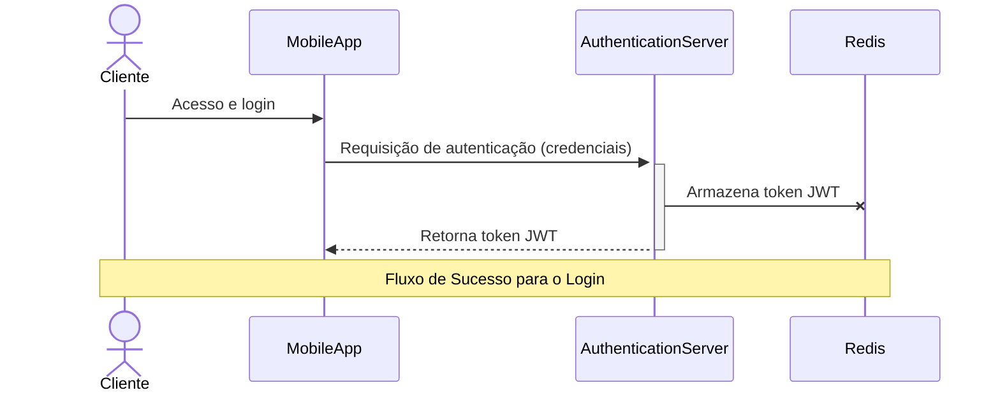
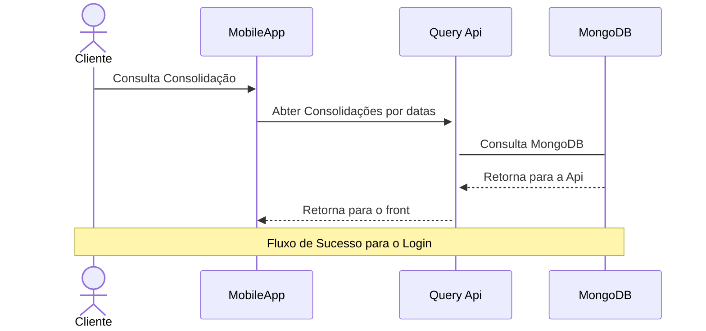
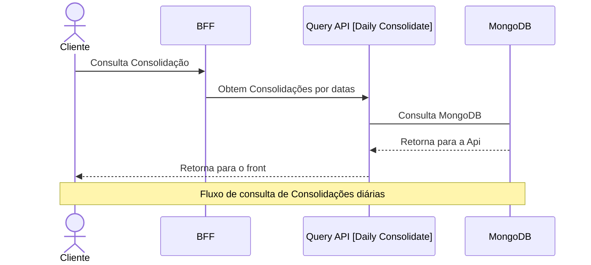

# Projeto
Este documento apresenta a arquitetura do sistema proposta para atender à missão de prover uma solução robusta, escalável e de fácil manutenção para o domínio em questão. Para viabilizar a estrutura do projeto e facilitar a orquestração dos diversos serviços e bancos de dados, foi adotado o uso de **Docker**, permitindo ambientes reprodutíveis e simplificando o processo de deploy e testes locais. Um ponto a ser mencionado. Para subir as imagens é um pouco demorado.

No início na criação dos containers


Depois de finalizada a criação das imagens e dos containers


A arquitetura segue o padrão **modular e orientado a serviços**, com separação clara entre front-end, BFFs, APIs de comando e consulta, workers e integrações externas, caracterizando uma abordagem **moderna baseada em microsserviços**. O desenvolvimento do código foi guiado por princípios de **Clean Architecture** e uso de **Design Patterns**, promovendo baixo acoplamento, alta coesão e facilidade de evolução. Para acesso a dados, foram utilizados tanto o **Dapper** quanto o **Entity Framework**, aproveitando o melhor de cada tecnologia conforme o cenário.

Devido ao foco principal na definição e implementação da arquitetura, e à limitação de tempo, **não foram implementados testes unitários** nesta etapa. A prioridade foi garantir uma base arquitetural sólida e alinhada às melhores práticas de desenvolvimento.

## Observabilidade:
A solução implementa observabilidade robusta por meio de logs centralizados, métricas e rastreamento distribuído. Todos os serviços geram logs estruturados (JSON) e enviam para o **ELK Stack** (Elasticsearch, Logstash, Kibana), permitindo análise detalhada de eventos, erros e auditoria. O **Logstash** processa e normaliza os logs, enquanto o **Elasticsearch** armazena e indexa para buscas rápidas. O **Kibana** oferece dashboards e visualizações acessíveis em:  
**Kibana:** [http://localhost:5601](http://localhost:5601)

Para facilitar a análise dos logs, é importante criar índices no Elasticsearch. Recomenda-se criar um índice específico para os logs da solução, por exemplo, `verx_index*`. No Kibana, acesse **Stack Management > Index Patterns** e crie um novo padrão de índice utilizando o nome configurado no Logstash (ex: `verx_index*`). Isso permitirá buscas rápidas, filtros por campos (como nível de log, serviço, timestamp) e criação de dashboards personalizados para monitoramento e troubleshooting.


Além dos logs, a telemetria é aplicada via instrumentação dos serviços com **OpenTelemetry**, coletando métricas de performance, disponibilidade e rastreamento de requisições ponta a ponta. O rastreamento distribuído é visualizado no **Jaeger**, facilitando a identificação de gargalos e análise de fluxos entre microsserviços:  
**Jaeger:** [http://localhost:16686](http://localhost:16686)

Essas ferramentas garantem visibilidade operacional, facilitam troubleshooting e apoiam a evolução contínua do sistema.


## Testando a Solução com Docker

Após inicializar todas as imagens do Docker, é possível validar o funcionamento dos principais fluxos utilizando comandos `curl` ou importando-os para o Postman para facilitar a execução e análise das respostas.

### 1. Enviando uma Transação

Este comando simula o envio de uma transação para o serviço de WebHook:

```bash
curl --location 'http://localhost:8082' \
--header 'Content-Type: application/json' \
--data '{
    "Amount":1000,
    "Currency": "BRL",
    "Description":"Thiago 9999 Bolos",
    "SenderAccountId":"123456-789",
    "ReceiverAccountId":"987654-321"
}'
```

### 2. Consultando Consolidações

Este comando realiza uma consulta de consolidações diárias:

```bash
curl --location 'http://localhost:8083/Consolidated/list' \
--header 'accept: text/plain'
```

### Como Exportar para o Postman

1. Copie o comando `curl` desejado.
2. No Postman, clique em **Import** (ou "Importar").
3. Selecione a aba **Raw text**.
4. Cole o comando `curl` e clique em **Continue**.
5. O Postman irá converter automaticamente o comando para uma requisição pronta para ser executada.

Dessa forma, é possível testar facilmente os endpoints da solução, validar integrações e analisar as respostas dos serviços.


# Documentação de Arquitetura de Sistema

## Digrama da Solução:


## 1. Cliente | Externo

### Cliente
- **Descrição**: Usuário final que acessa o sistema via **mobile** ou **web**.
- **Interação**: Comunicação com os BFFs correspondentes (Mobile ou Web) para autenticação, comandos e consultas.

---

## 2. Front-end

### Mobile / Web
- **Descrição**: Interfaces que permitem o acesso ao sistema pelos usuários.
- **Função**: Consome os serviços expostos pelos BFFs, autenticando-se via tokens JWT.

---

## 3. Back-end

### 3.1. Authentication Server

#### Serviços de Autenticação
- **CICD**: Sim
- **Tipo**: Pod Kubernets
- **Contenerizado**: Sim
- **Platarforma**: GKE
- **Tecnologia**: .NET Web API
- **Responsabilidade**:
  - Geração e validação de **tokens JWT**.
  - Central de autenticação tanto para Mobile quanto Web.
- **Conexões**:
  - Utilizado por ambos os BFFs (`BFF Mobile` e `BFF Web`).
  - Armazena tokens em **Redis**.

---

### 3.2. BFF (Backend for Frontend)

#### BFF Mobile [BFFMobileFlow]
- **CICD**: Sim
- **Tipo**: Serveless
- **Contenerizado**: Sim
- **Platarforma**: GCP Functions
- **Tecnologia**: .NET Minimal API
- **Responsabilidade**:
  - Adaptar a comunicação entre os serviços internos e o aplicativo mobile.
  - Validar token JWT antes de processar chamadas.
- **Conexões**:
  - Recebe requisições do app mobile.
  - Utiliza `Authentication Server` para validação de JWT.
  - Comunica-se com:
    - `Command API`
    - `Query API`
    - `WebHook Transações` (produção de eventos Kafka)

#### BFF Web [BFFWebFlow]
- **CICD**: Sim
- **Tipo**: Serveless
- **Contenerizado**: Sim
- **Platarforma**: GCP Functions
- **Tecnologia**: .NET Minimal API
- **Responsabilidade**:
  - Adaptar a comunicação entre os serviços internos e a interface web.
  - Validar token JWT antes de processar chamadas.
- **Conexões**:
  - Recebe requisições da interface Web.
  - Utiliza `Authentication Server` para validação de JWT.
  - Comunica-se com:
    - `Command API`
    - `Query API`
    - `WebHook Transações`

---

### 3.3. Serviços Consolidados (Daily Consolidate)

#### Query API
- **CICD**: Sim
- **Tipo**: Pod Kubernets
- **Contenerizado**: Sim
- **Platarforma**: GKE
- **Tecnologia**: .NET Core Web API
- **Responsabilidade**: 
  - Prover **consultas** de consolidação diária.
- **Conexões**:
  - Utilizado pelos BFFs.
  - Consulta bancos: `SQL Server [DailyConsolidate]` e `MongoDB [DailyConsolidate]`.

#### Command API
- **CICD**: Sim
- **Tipo**: Pod Kubernets
- **Contenerizado**: Sim
- **Platarforma**: GKE
- **Tecnologia**: .NET Core Web API
- **Responsabilidade**: 
  - Prover **modificações** e comandos relacionados à consolidação diária.
- **Conexões**:
  - Utilizado pelos BFFs.
  - Envia eventos para o `Worker [Daily Consolidate]`.

#### Worker [Daily Consolidate]
- **CICD**: Sim
- **Tipo**: Pod Kubernets
- **Contenerizado**: Sim
- **Platarforma**: GKE
- **Tecnologia**: .NET HostedService
- **Responsabilidade**: 
  - Consumir eventos de comando.
  - Manipular e persistir dados em bancos após os comandos.
- **Conexões**:
  - Recebe eventos do `Command API`.
  - Interage com:
    - `SQL Server [DailyConsolidate]`
    - `MongoDB [DailyConsolidate]`
    - `RabbitMQ [DailyConsolidate]`

---

### 3.4. Serviços de Transações

#### WebHook [Transactions]
- **CICD**: Sim
- **Tipo**: Serveless
- **Contenerizado**: Sim
- **Platarforma**: GCP Functions
- **Tecnologia**: .NET Core Web API
- **Responsabilidade**: 
  - Atuar como produtor de eventos no **Kafka** (`TransactionFlow Events`).
- **Conexões**:
  - Recebe chamadas dos BFFs (mobile/web).
  - Envia eventos para `Kafka`.

#### Worker [Transactions]
- **CICD**: Sim
- **Tipo**: Pod Kubernets
- **Contenerizado**: Sim
- **Platarforma**: GKE
- **Tecnologia**: .NET Core Web API
- **Responsabilidade**:
  - Consumir eventos do `Kafka [TransactionFlow Events]`.
  - Persistir os dados no banco `SQL Server [TransactionFlow]`.
- **Conexões**:
  - Kafka → Worker → SQL Server

---

## 4. Componentes Externos

### SQL Server [DailyConsolidate]
- **Descrição**: Banco de dados relacional para dados consolidados diários.
- **Uso**: Consultas (`Query API`) e persistência de eventos processados (`Worker`).

### SQL Server [TransactionFlow]
- **Descrição**: Armazena eventos de transações processadas pelo `Worker Transações`.

### MongoDB [DailyConsolidate]
- **Descrição**: Banco de dados NoSQL usado para armazenar dados de consolidação diária.
- **Uso**: Alternativa ou complemento ao SQL Server em `Query API` e `Worker`.

### Redis [Token JWT]
- **Descrição**: Armazena tokens JWT temporariamente para rápida validação.
- **Utilizado por**: `Authentication Server`.

### Kafka [TransactionFlow Events]
- **Descrição**: Sistema de mensageria para eventos de transações.
- **Uso**:
  - Produzido por: `WebHook Transações`.
  - Consumido por: `Worker Transações`.

### RabbitMQ [DailyConsolidate]
- **Descrição**: Sistema de fila para consolidação diária.
- **Uso**:
  - Consumido pelo `Worker [Daily Consolidate]`.

---

## 5. Fluxos Principais

### 5.1. Autenticação
1. Cliente (mobile/web) → `BFF` → `Authentication Server`
2. Recebe token JWT
3. Complementa Informações de Usuário e salva em cache



### 5.2. Consulta de Consolidação
1. Cliente → `BFF` → `Query API`
2. Query API → MongoDB


### 5.3. Consulta de Consolidação
1. Cliente → `BFF` → `Query API [Daily Consolidate]`
2. `Query API [Daily Consolidate]` → `MongoDB`
3. `MongoDB` → `Query API [Daily Consolidate]`
4. `Query API [Daily Consolidate]` → Cliente



### 5.4. Transações
1. Cliente → `BFF` → `WebHook [Transactions]`
2. Kafka → `Worker [Transactions]`
3. `Worker [Transactions]` → `Command API [Daily Consolidate]`
4. `Command API [Daily Consolidate]` → `RabbitMQ`
5. `Command API [Daily Consolidate]` → `SqlServer`
6. `RabbitMQ` → `Worker [Daily Consolidate]`
7. `Worker [Daily Consolidate]` → `MongoDB`


---

## 6. Observações Técnicas

- **JWT como mecanismo de segurança** é central em todos os fluxos.
- **Kafka vs RabbitMQ**:
  - Kafka → transações assíncronas, fluxo contínuo e distribuído.
  - RabbitMQ → mensagens de consolidação com menor volume, mas sensíveis à ordem e confirmação.
- **Redis** é utilizado para manter informações sensíveis que não podesem ser mandadas no token de autenticação. Essas informações são devolvidas se o token for válido.
- **MongoDB e SQL Server** coexistem para escalabilidade e flexibilidade de modelagem.
