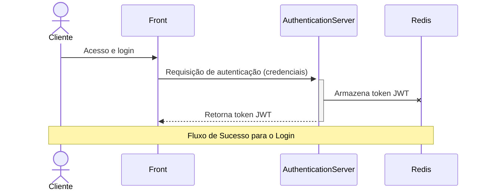
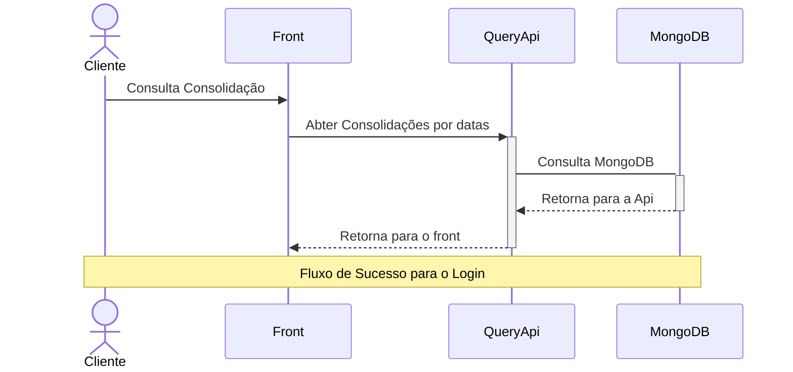
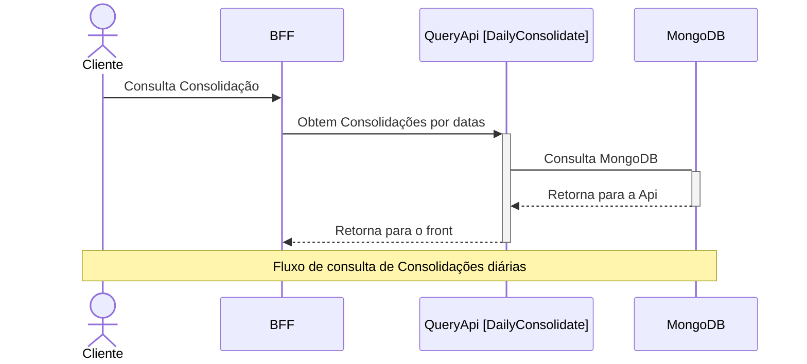
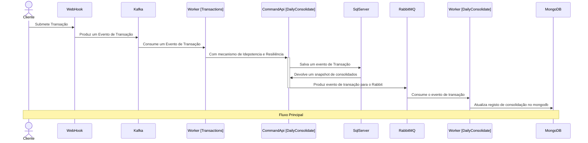

# Projeto
Este documento apresenta a arquitetura do sistema proposta para atender à missão de prover uma solução robusta, escalável e de fácil manutenção para o domínio em questão. Para viabilizar a estrutura do projeto e facilitar a orquestração dos diversos serviços e bancos de dados, foi adotado o uso de **Docker**, permitindo ambientes reprodutíveis e simplificando o processo de deploy e testes locais. Um ponto a ser mencionado. Para subir as imagens é um pouco demorado.

No início na criação dos containers


Depois de finalizada a criação das imagens e dos containers


A arquitetura segue o padrão **modular e orientado a serviços**, com separação clara entre front-end, BFFs, APIs de comando e consulta, workers e integrações externas, caracterizando uma abordagem **moderna baseada em microsserviços**. O desenvolvimento do código foi guiado por princípios de **Clean Architecture** e uso de **Design Patterns**, promovendo baixo acoplamento, alta coesão e facilidade de evolução. Para acesso a dados, foram utilizados tanto o **Dapper** quanto o **Entity Framework**, aproveitando o melhor de cada tecnologia conforme o cenário.

## Modelagem Event-Sourcing no VerxTransaction

O banco de dados **VerxTransaction** foi modelado seguindo o padrão **event-sourcing** para registrar e gerenciar o histórico de transações. Essa abordagem foi escolhida por diversos motivos:

### Por que event-sourcing?

- **Rastreabilidade e Auditoria:** Cada alteração de estado é registrada como um evento imutável, permitindo reconstruir todo o histórico de uma transação e atender requisitos de auditoria.
- **Consistência e Integridade:** O modelo garante que o estado atual é sempre resultado da aplicação sequencial dos eventos, reduzindo inconsistências.
- **Facilidade para integrações e reprocessamentos:** Eventos podem ser reprocessados ou publicados para outros sistemas, facilitando integrações e correções retroativas.
- **Escalabilidade:** O armazenamento de eventos desacopla o processamento do comando da atualização do estado, facilitando a escalabilidade horizontal dos serviços.

### Vantagens

- **Histórico completo:** Permite saber exatamente como e quando cada alteração ocorreu.
- **Flexibilidade para novas projeções:** Novos modelos de leitura podem ser criados a partir dos eventos, sem alterar o modelo de gravação.
- **Resiliência:** Possibilita reprocessar eventos em caso de falhas ou bugs, corrigindo projeções sem perda de dados.
- **Desacoplamento:** Facilita a separação entre gravação (comando) e leitura (consulta), alinhando-se ao padrão CQRS.

### Trade-offs

- **Complexidade:** A implementação é mais complexa do que CRUD tradicional, exigindo controle de versionamento, idempotência e mecanismos de replay.
- **Custo de armazenamento:** O volume de dados pode crescer rapidamente, exigindo estratégias de snapshot e arquivamento.
- **Curva de aprendizado:** Equipes precisam se adaptar ao novo paradigma, tanto para desenvolvimento quanto para manutenção e suporte.

Em resumo, a modelagem event-sourcing no **VerxTransaction** foi adotada para garantir rastreabilidade, flexibilidade e robustez, mesmo com o aumento da complexidade e dos requisitos operacionais.

## Escolha dos Bancos de Dados: Motivações, Vantagens e Trade-offs

A arquitetura utiliza diferentes bancos de dados para atender requisitos específicos de cada contexto do sistema. A seguir, detalham-se os motivos da escolha de cada tecnologia, suas vantagens e os principais trade-offs:

### MongoDB

**Motivação:**  
MongoDB foi escolhido para armazenar dados de consolidação diária devido à sua flexibilidade de modelagem, facilidade para lidar com grandes volumes de dados semi-estruturados e consultas rápidas para leitura.

**Vantagens:**
- Modelagem flexível (documentos JSON).
- Escalabilidade horizontal nativa.
- Consultas ágeis para grandes volumes de dados.
- Ideal para cenários onde o esquema pode evoluir.

**Trade-offs:**
- Menor aderência a transações complexas.
- Consistência eventual por padrão.
- Pode exigir cuidados extras para garantir integridade referencial.

---

### Redis

**Motivação:**  
Redis é utilizado como cache e armazenamento temporário de tokens JWT e dados sensíveis, proporcionando alta performance em operações de leitura e escrita.

**Vantagens:**
- Latência extremamente baixa.
- Suporte a estruturas de dados avançadas.
- Ideal para cache, sessões e dados temporários.
- Simples de operar em ambientes distribuídos.

**Trade-offs:**
- Dados armazenados em memória (volatilidade).
- Não indicado para persistência de longo prazo.
- Capacidade limitada ao tamanho da memória disponível.

---

### SQL Server

**Motivação:**  
SQL Server foi adotado para persistência de eventos (event-sourcing) e dados transacionais, aproveitando recursos avançados de integridade, transações e consultas relacionais.

**Vantagens:**
- Suporte robusto a transações ACID.
- Ferramentas maduras de administração e backup.
- Ideal para cenários que exigem integridade e rastreabilidade.
- Suporte a consultas complexas e integrações empresariais.

**Trade-offs:**
- Escalabilidade horizontal mais complexa.
- Licenciamento pode ser oneroso.
- Menos flexível para mudanças frequentes de esquema.

---

### PostgreSQL

**Motivação:**  
PostgreSQL pode ser utilizado como alternativa relacional open-source, oferecendo recursos avançados, extensibilidade e custo reduzido.

**Vantagens:**
- Open-source, sem custos de licença.
- Suporte a transações ACID e extensibilidade (ex: JSONB, índices avançados).
- Comunidade ativa e grande ecossistema de extensões.
- Bom equilíbrio entre performance e flexibilidade.

**Trade-offs:**
- Pode exigir tuning para workloads muito grandes.
- Algumas features empresariais podem demandar extensões ou configuração adicional.
- Menor integração nativa com ferramentas Microsoft.

---

### Considerações Gerais

A combinação dessas tecnologias permite que cada serviço utilize o banco de dados mais adequado ao seu perfil de acesso e requisitos de negócio, promovendo desempenho, escalabilidade e flexibilidade. O principal trade-off é o aumento da complexidade operacional, exigindo conhecimento e monitoramento de múltiplas tecnologias, além de estratégias de integração e consistência entre os dados.


Devido ao foco principal na definição e implementação da arquitetura, e à limitação de tempo, **não foram implementados testes unitários** nesta etapa. A prioridade foi garantir uma base arquitetural sólida e alinhada às melhores práticas de desenvolvimento.

## Observabilidade
A solução implementa observabilidade robusta por meio de logs centralizados, métricas e rastreamento distribuído. Todos os serviços geram logs estruturados (JSON) e enviam para o **ELK Stack** (Elasticsearch, Logstash, Kibana), permitindo análise detalhada de eventos, erros e auditoria. O **Logstash** processa e normaliza os logs, enquanto o **Elasticsearch** armazena e indexa para buscas rápidas. O **Kibana** oferece dashboards e visualizações acessíveis em:  
**Kibana:** [http://localhost:5601](http://localhost:5601)

Para facilitar a análise dos logs, é importante criar índices no Elasticsearch. Recomenda-se criar um índice específico para os logs da solução, por exemplo, `verx_index*`. No Kibana, acesse **Stack Management > Index Patterns** e crie um novo padrão de índice utilizando o nome configurado no Logstash (ex: `verx_index*`). Isso permitirá buscas rápidas, filtros por campos (como nível de log, serviço, timestamp) e criação de dashboards personalizados para monitoramento e troubleshooting.


Além dos logs, a telemetria é aplicada via instrumentação dos serviços com **OpenTelemetry**, coletando métricas de performance, disponibilidade e rastreamento de requisições ponta a ponta. O rastreamento distribuído é visualizado no **Jaeger**, facilitando a identificação de gargalos e análise de fluxos entre microsserviços:  
**Jaeger:** [http://localhost:16686](http://localhost:16686)

Essas ferramentas garantem visibilidade operacional, facilitam troubleshooting e apoiam a evolução contínua do sistema.


## Testando a Solução com Docker

Após inicializar todas as imagens do Docker, é possível validar o funcionamento dos principais fluxos utilizando comandos `curl` ou importando-os para o Postman para facilitar a execução e análise das respostas.

### 1. Enviando uma Transação

Este comando simula o envio de uma transação para o serviço de WebHook:

```bash
curl --location 'http://localhost:8082' \
--header 'Content-Type: application/json' \
--data '{
    "Amount":1000,
    "Currency": "BRL",
    "Description":"Thiago 9999 Bolos",
    "SenderAccountId":"123456-789",
    "ReceiverAccountId":"987654-321"
}'
```

### 2. Consultando Consolidações

Este comando realiza uma consulta de consolidações diárias:

```bash
curl --location 'http://localhost:8083/Consolidated/list' \
--header 'accept: text/plain'
```

### Como Exportar para o Postman

1. Copie o comando `curl` desejado.
2. No Postman, clique em **Import** (ou "Importar").
3. Selecione a aba **Raw text**.
4. Cole o comando `curl` e clique em **Continue**.
5. O Postman irá converter automaticamente o comando para uma requisição pronta para ser executada.

Dessa forma, é possível testar facilmente os endpoints da solução, validar integrações e analisar as respostas dos serviços.


# Documentação de Arquitetura de Sistema

## Digrama da Solução:


## 1. Cliente | Externo

### Cliente
- **Descrição**: Usuário final que acessa o sistema via **mobile** ou **web**.
- **Interação**: Comunicação com os BFFs correspondentes (Mobile ou Web) para autenticação, comandos e consultas.

---

## 2. Front-end

### Mobile / Web
- **Descrição**: Interfaces que permitem o acesso ao sistema pelos usuários.
- **Função**: Consome os serviços expostos pelos BFFs, autenticando-se via tokens JWT.

---

## 3. Back-end

### 3.1. Authentication Server

#### Serviços de Autenticação
- **CICD**: Sim
- **Tipo**: Pod Kubernets
- **Contenerizado**: Sim
- **Platarforma**: GKE
- **Tecnologia**: .NET Web API
- **Responsabilidade**:
  - Geração e validação de **tokens JWT**.
  - Central de autenticação tanto para Mobile quanto Web.
- **Conexões**:
  - Utilizado por ambos os BFFs (`BFF Mobile` e `BFF Web`).
  - **Redis** armazena de dados sensveis que não podem trafegar no token, atua como uma forma eficiente para recuperar esses dados sem necessidade de consulta a serviço externo ou banco.

---

### 3.2. BFF (Backend for Frontend)

#### BFF Mobile [BFFMobileFlow]
- **CICD**: Sim
- **Tipo**: Serveless
- **Contenerizado**: Sim
- **Platarforma**: GCP Functions
- **Tecnologia**: .NET Minimal API
- **Responsabilidade**:
  - Adaptar a comunicação entre os serviços internos e o aplicativo mobile.
  - Validar token JWT antes de processar chamadas.
- **Conexões**:
  - Recebe requisições do app mobile por meio de **RestServices**.
  - Utiliza `Authentication Server` para validação de JWT.
  - Comunica-se com:
    - `CommandApi` por meio de **gRPC**
    - `QueryApi` por meio de **gRPC**

#### BFF Web [BFFWebFlow]
- **CICD**: Sim
- **Tipo**: Serveless
- **Contenerizado**: Sim
- **Platarforma**: GCP Functions
- **Tecnologia**: .NET Minimal API
- **Responsabilidade**:
  - Adaptar a comunicação entre os serviços internos e a interface web.
  - Validar token JWT antes de processar chamadas.
- **Conexões**:
  - Recebe requisições da interface Web por meio de **RestServices**.
  - Utiliza `Authentication Server` para validação de JWT.
  - Comunica-se com:
    - `CommandApi` por meio de **gRPC**
    - `QueryApi` por meio de **gRPC**

---

### 3.3. Serviços Consolidados (DailyConsolidate)

#### QueryApi
- **CICD**: Sim
- **Tipo**: Pod Kubernets
- **Contenerizado**: Sim
- **Platarforma**: GKE
- **Tecnologia**: .NET Core Web API
- **Responsabilidade**: 
  - Prover **consultas** de consolidação diária.
- **Conexões**:
  - Utilizado pelos BFFs.
  - Consulta ao `MongoDB [DailyConsolidate]`.

#### CommandApi
- **CICD**: Sim
- **Tipo**: Pod Kubernets
- **Contenerizado**: Sim
- **Platarforma**: GKE
- **Tecnologia**: .NET Core Web API
- **Responsabilidade**: 
  - Prover **modificações** e comandos relacionados à consolidação diária.
- **Conexões**:
  - Envia eventos de Transaction para o `Worker [DailyConsolidate]`.

#### Worker [DailyConsolidate]
- **CICD**: Sim
- **Tipo**: Pod Kubernets
- **Contenerizado**: Sim
- **Platarforma**: GKE
- **Tecnologia**: .NET HostedService
- **Responsabilidade**: 
  - Consumir eventos de comando.
  - Manipular e persistir dados em bancos após os comandos.
- **Conexões**:
  - Consumir Eventos do `RabbitMQ`.
  - Interage com:
    - `RabbitMQ [DailyConsolidate]`
    - `SqlServer [DailyConsolidate]`
    - `MongoDB [DailyConsolidate]`

---

### 3.4. Serviços de Transações

#### WebHook [Transactions]
- **CICD**: Sim
- **Tipo**: Serveless
- **Contenerizado**: Sim
- **Platarforma**: GCP Functions
- **Tecnologia**: .NET Core Web API
- **Responsabilidade**: 
  - Atuar como produtor de eventos no **Kafka** (`TransactionEvent`).
- **Conexões**:
  - Recebe chamadas dos BFFs (mobile/web).
  - Envia eventos para `Kafka`.

#### Worker [Transactions]
- **CICD**: Sim
- **Tipo**: Pod Kubernets
- **Contenerizado**: Sim
- **Platarforma**: GKE
- **Tecnologia**: .NET Core Web API
- **Responsabilidade**:
  - Consumir eventos do `Kafka [TransactionEvent]`.
  - Fazer requisições **gRPC** para a `CommandApi [DailyConsolidate]`
  - Atuar com Idepotência
  - Atuar com Resiliência se utilizando de menimos de retry e deadletter (RabbitMq)
- **Conexões**:
  - Kafka → Worker → CommandApi → SqlServer 

---

## 4. Componentes Externos

### SqlServer [VerxTransaction]
- **Descrição**: Banco de dados relacional seguindo event-sourcing model para dados consolidados diários.
- **Uso**: Consultas (`QueryApi`) e persistência de eventos processados (`Worker`).

### SqlServer [TransactionFlow]
- **Descrição**: Armazena eventos de transações processadas pelo `Worker [Transactions]`.

### MongoDB [DailyConsolidate]
- **Descrição**: Banco de dados NoSQL usado para armazenar dados de consolidação diária.
- **Uso**: Alternativa ou complemento ao SqlServer em `QueryApi` e `Worker`.

### Redis [Token JWT]
- **Descrição**: Armazena tokens JWT temporariamente para rápida validação.
- **Utilizado por**: `Authentication Server`.

### Kafka [TransactionFlow Events]
- **Descrição**: Sistema de mensageria para eventos de transações.
- **Uso**:
  - Produzido por: `WebHook [Transactions]`.
  - Consumido por: `Worker [Transactions]`.

### RabbitMQ [DailyConsolidate]
- **Descrição**: Sistema de fila para consolidação diária.
- **Uso**:
  - Consumido pelo `Worker [DailyConsolidate]`.

---

## 5. Fluxos Principais

### 5.1. Autenticação
1. Cliente (mobile/web) → `BFF` → `Authentication Server`
2. Recebe token JWT
3. Complementa Informações de Usuário e salva em cache



### 5.2. Consulta de Consolidação
1. Cliente → `BFF` → `QueryApi`
2. QueryApi → MongoDB


### 5.3. Consulta de Consolidação
1. Cliente → `BFF` → `QueryApi [DailyConsolidate]`
2. `QueryApi [DailyConsolidate]` → `MongoDB`
3. `MongoDB` → `QueryApi [DailyConsolidate]`
4. `QueryApi [DailyConsolidate]` → Cliente



### 5.4. Transações
1. Cliente → `BFF` → `WebHook [Transactions]`
2. Kafka → `Worker [Transactions]`
3. `Worker [Transactions]` → `CommandApi [DailyConsolidate]`
4. `CommandApi [DailyConsolidate]` → `RabbitMQ`
5. `CommandApi [DailyConsolidate]` → `SqlServer`
6. `RabbitMQ` → `Worker [DailyConsolidate]`
7. `Worker [DailyConsolidate]` → `MongoDB`



---

## 6. Observações Técnicas
- **Worker [Transactions]** ficou redundante, visto que esse caminho poderia ser cortado. Poderia ser utilizado o **Worker [DailyConsolidate]**. Mas Seguindo uma estratégia de separação por contexto de negócio, vale a redundância, já que dentro do contexto, podemos ter operações de negócios bem expecíficas, sendo assim ganhasse um desacoplamento.
- **Event-Driven e Event-Sourcing** O bando de dados segue uma estrutura orientada a evento.
- **JWT como mecanismo de segurança** é central em todos os fluxos.
- **Kafka vs RabbitMQ**:
  - Kafka → transações assíncronas, fluxo contínuo e distribuído.
  - RabbitMQ → mensagens de consolidação com menor volume, mas sensíveis à ordem e confirmação.
- **Redis** é utilizado para manter informações sensíveis que não podesem ser mandadas no token de autenticação. Essas informações são devolvidas se o token for válido.
- **MongoDB e SqlServer** coexistem para escalabilidade e flexibilidade de modelagem.
