README — Projeto de Arquitetura de Sistema com Microsserviços e Observabilidade

### Índice
1. [Resumo do Projeto](#resumo-do-projeto)
2. [Arquitetura Geral](#arquitetura-geral)
3. [Modelagem com Event Sourcing](#modelagem-com-event-sourcing)
4. [Bancos de Dados Utilizados e Cache Distribuído](#bancos-de-dados-utilizados)
5. [Observabilidade](#observabilidade)
6. [Testes Automatizados](#testes-automatizados)
7. [Execução com Docker](#execução-com-docker)
8. [Fluxos Principais](#fluxos-principais)
9. [Decisões Arquiteturais](#decisões-arquiteturais)
10. [Componentes](#componentes)
11. [Bibliotecas Compartilhadas](#bibliotecas-compartilhadas)
12. [Considerações Finais](#bibliotecas-compartilhadas)

## Resumo do Projeto
manutenção facilitada, adotando a arquitetura de microsserviços com separação clara entre front-end, BFFs, APIs, workers e integrações externas.

Para garantir reprodutibilidade de ambientes e simplificar o deploy, foi adotado o uso de **Docker** para orquestração dos serviços. A inicialização pode levar alguns minutos na primeira execução, devido à criação das imagens.

**Status Inicial**
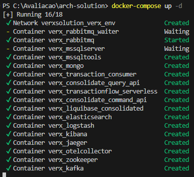


**Containers Prontos**
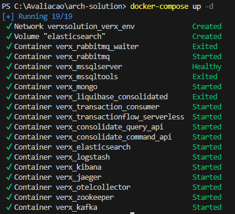

---

## Arquitetura Geral

A arquitetura segue os padrões de:
- **Clean Architecture**
- **Design Patterns**
- **Separação de contextos (DDD)**
- **BFF (Backend for Frontend)**
- **CQRS + Event Sourcing**

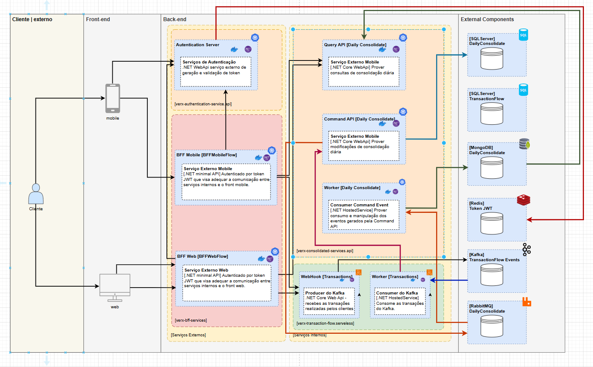

Todas as APIs, workers e BFFs são containerizados e implantados em GCP (GKE ou Cloud Functions), promovendo uma solução moderna, resiliente e altamente escalável.

---

## Modelagem com Event Sourcing

O banco **VerxTransaction** foi modelado com **Event Sourcing** para garantir rastreabilidade completa, reprocessamento de eventos e separação entre escrita e leitura.

### Vantagens
- Histórico auditável
- Criação de múltiplas projeções sem alterar eventos originais
- Reprocessamento e resiliência
- Alinhamento com o padrão **CQRS**

### Trade-offs
- Complexidade na implementação (controle de versionamento e idempotência)
- Necessidade de snapshots e estratégias de arquivamento
- Curva de aprendizado elevada

**Estruturas**
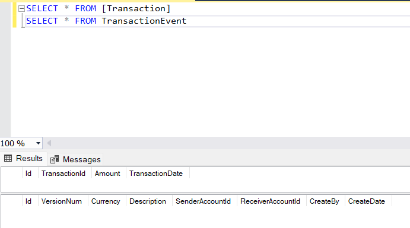

---

## Bancos de Dados Utilizados e Cache Distribuído

| Tecnologia  | Finalidade Principal                            | Vantagens                                                       | Trade-offs                                 |
|------------|--------------------------------------------------|----------------------------------------------------------------|--------------------------------------------|
| MongoDB    | Consolidações diárias (leitura flexível)        | JSON, escalável, esquema dinâmico                              | Consistência eventual, integridade manual  |
| Redis      | Armazenamento temporário de dados sensíveis     | Baixa latência, eficiente para JWT/cache                       | Volátil, não indicado para persistência    |
| SQL Server | Event Sourcing e persistência de transações     | ACID, queries complexas, rastreabilidade                       | Licenciamento oneroso, pouco flexível      |
| PostgreSQL | Alternativa relacional open-source              | JSONB, extensível, gratuito                                    | Demanda tuning para grandes workloads      |

### Considerações Gerais

A combinação dessas tecnologias permite que cada serviço utilize o banco de dados mais adequado ao seu perfil de acesso e requisitos de negócio, promovendo desempenho, escalabilidade e flexibilidade. O principal trade-off é o aumento da complexidade operacional, exigindo conhecimento e monitoramento de múltiplas tecnologias, além de estratégias de integração e consistência entre os dados.

---

## Observabilidade

A solução adota **ELK Stack** (Elasticsearch, Logstash, Kibana) + **Jaeger + OpenTelemetry** para garantir visibilidade ponta a ponta.

- Logs estruturados (JSON) com CorrelationId via `X-Correlation-Id`
- Métricas e tracing com OpenTelemetry
- Visualização de spans e fluxos em Jaeger

**Fluxo de Retry**
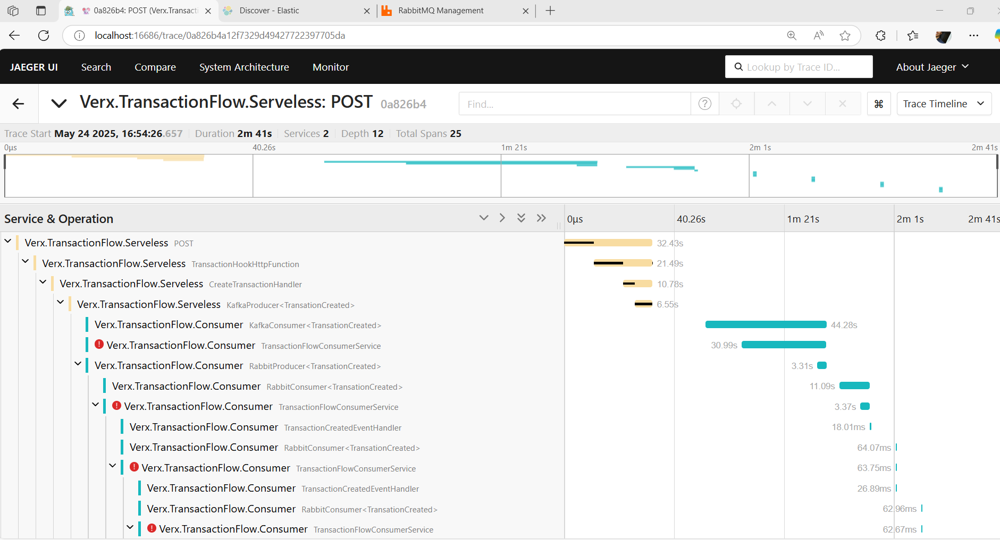

**Fluxo de Retry e Sucesso**
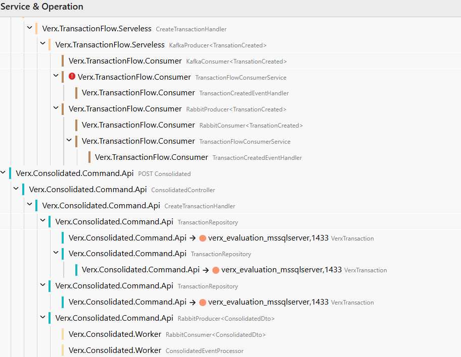

**Fluxo de Sucesso**
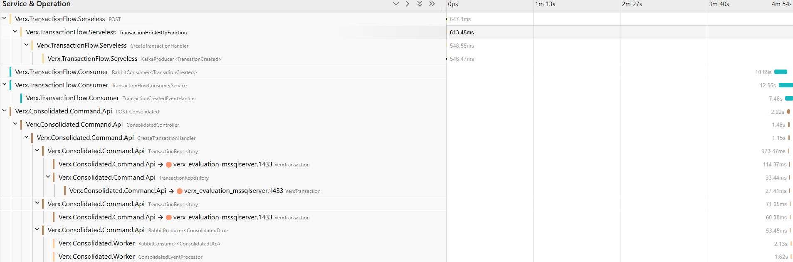
> **Observação:**  
> Para facilitar a análise dos logs, crie um índice dedicado no Elasticsearch, como `verx_index*`. No Kibana, vá em **Stack Management > Index Patterns** e cadastre esse padrão. Assim, é possível buscar, filtrar e criar dashboards rapidamente para monitoramento e troubleshooting.

## Testes Automatizados

Foram utilizados os frameworks:
- `xUnit`
- `Moq`
- `AutoFixture`
- `FluentAssertions`

Exemplos de execução de testes:

**Testes Unitários TransactionFlow Services**
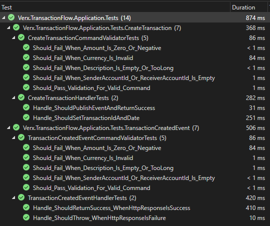

**Testes Unitários Consolidated Services**
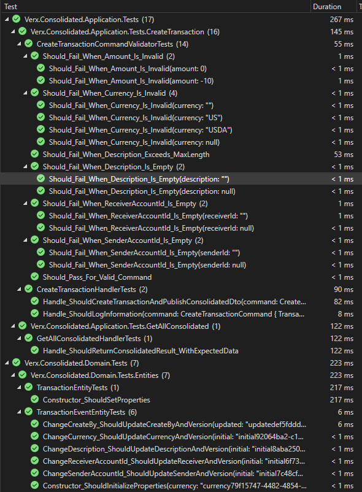

## Execução com Docker

### Pré-requisitos:
- Docker instalado e configurado

### Instruções:
```bash
docker-compose up --build
```

Acesse:
- Kibana: [http://localhost:5601](http://localhost:5601)
- Jaeger: [http://localhost:16686](http://localhost:16686)

### Testes com `curl`

#### Enviar Transação
```bash
curl --location 'http://localhost:8082' \
--header 'Content-Type: application/json' \
--data '{
    "Amount":1000,
    "Currency": "BRL",
    "Description":"Thiago 9999 Bolos",
    "SenderAccountId":"123456-789",
    "ReceiverAccountId":"987654-321"
}'
```

#### Consultar Consolidação
```bash
curl --location 'http://localhost:8083/Consolidated/list' --header 'accept: text/plain'
```

Para facilitar testes, importe os comandos no Postman via "Raw text".

## Fluxos Principais

### Autenticação
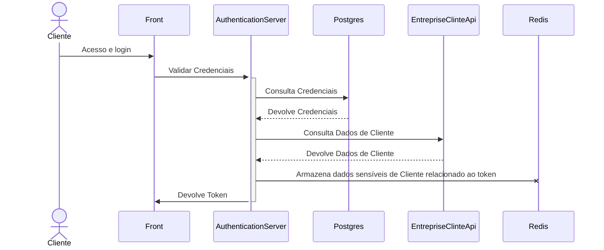

### Consulta de Consolidação

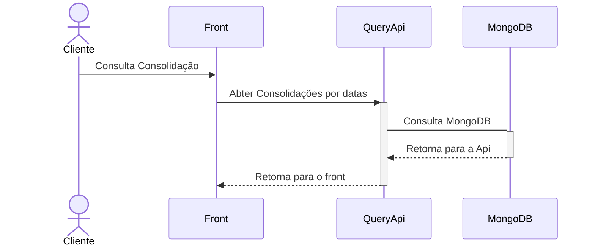
### Consulta de Consolidação

### Transações

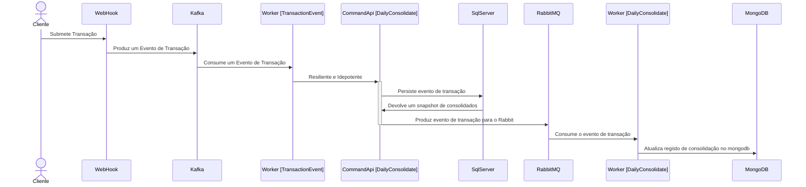

## Decisões Arquiteturais

### Kafka vs RabbitMQ
- **Kafka**: utilizado para comportar os eventos de transações permitindo um throughput alto em volume e processamento
- **RabbitMQ**: utilizado para manter a resiliências nos consumidores de transações e consumidor de evento de consolidação.

### Redis para Dados Sensíveis
- Informações sensíveis são guardadas fora do JWT e recuperadas via cache no processo de validação do JWT.

### Workers por Contexto
- A separação por contexto, garante independência e aderência ao DDD. Cabendo maior flexibilidade para escalar tanto vesticalmente quanto horizontalmente.

--
## Componentes

### Front-end

### Mobile / Web
- **Descrição**: Interfaces que permitem o acesso ao sistema pelos usuários.
- **Função**: Consome os serviços expostos pelos BFFs, autenticando-se via tokens JWT.

---

### Back-end

#### Authentication Server
- **CICD**: Sim
- **Tipo**: Pod Kubernets
- **Contenerizado**: Sim
- **Plataforma**: GKE
- **Tecnologia**: .NET Web API
- **Responsabilidade**:
  - Geração e validação de **tokens JWT**.
  - Central de autenticação tanto para Mobile quanto Web.
- **Conexões**:
  - Utilizado por ambos os BFFs (`BFF Mobile` e `BFF Web`).
  - **Redis** Armazena dados sensíveis que não podem trafegar no token, atua como uma forma eficiente para recuperar esses dados sem necessidade de consulta a serviço externo ou banco.

---

### BFF (Backend for Frontend)

##### BFF Mobile [BFFMobileFlow]
- **CICD**: Sim
- **Tipo**: Serverless
- **Contenerizado**: Sim
- **Plataforma**: GCP Functions
- **Tecnologia**: .NET Minimal API
- **Responsabilidade**:
  - Adaptar a comunicação entre os serviços internos e o aplicativo mobile.
  - Validar token JWT antes de processar chamadas.
- **Conexões**:
  - Recebe requisições do app mobile por meio de **RestServices**.
  - Utiliza `Authentication Server` para validação de JWT.
  - Comunica-se com:
    - `CommandApi` por meio de **gRPC**
    - `QueryApi` por meio de **gRPC**

##### BFF Web [BFFWebFlow]
- **CICD**: Sim
- **Tipo**: Serverless
- **Contenerizado**: Sim
- **Plataforma**: GCP Functions
- **Tecnologia**: .NET Minimal API
- **Responsabilidade**:
  - Adaptar a comunicação entre os serviços internos e a interface web.
  - Validar token JWT antes de processar chamadas.
- **Conexões**:
  - Recebe requisições da interface Web por meio de **RestServices**.
  - Utiliza `Authentication Server` para validação de JWT.
  - Comunica-se com:
    - `CommandApi` por meio de **gRPC**
    - `QueryApi` por meio de **gRPC**

---

### Serviços Consolidados (DailyConsolidate)

#### QueryApi
- **CICD**: Sim
- **Tipo**: Pod Kubernets
- **Contenerizado**: Sim
- **Plataforma**: GKE
- **Tecnologia**: .NET Core Web API
- **Responsabilidade**: 
  - Prover **consultas** de consolidação por dia.
- **Conexões**:
  - Utilizado pelos BFFs.
  - Consulta ao `MongoDB [DailyConsolidate]`.

#### CommandApi
- **CICD**: Sim
- **Tipo**: Pod Kubernets
- **Contenerizado**: Sim
- **Plataforma**: GKE
- **Tecnologia**: .NET Core Web API
- **Responsabilidade**: 
  - Prover **modificações** e comandos relacionados à consolidação diária.
- **Conexões**:
  - Envia eventos de Transaction para o `Worker [DailyConsolidate]`.

#### Worker [DailyConsolidate]
- **CICD**: Sim
- **Tipo**: Pod Kubernets
- **Contenerizado**: Sim
- **Plataforma**: GKE
- **Tecnologia**: .NET HostedService
- **Responsabilidade**: 
  - Consumir eventos de comando.
  - Manipular e persistir dados em bancos após os comandos.
- **Conexões**:
  - Consumir Eventos do `RabbitMQ`.
  - Interage com:
    - `RabbitMQ [DailyConsolidate]`
    - `SqlServer [DailyConsolidate]`
    - `MongoDB [DailyConsolidate]`

---

### Serviços de Transações

#### WebHook [Transactions]
- **CICD**: Sim
- **Tipo**: Serverless
- **Contenerizado**: Sim
- **Plataforma**: GCP Functions
- **Tecnologia**: .NET Core Web API
- **Responsabilidade**: 
  - Atuar como produtor de eventos no **Kafka** (`TransactionEvent`).
- **Conexões**:
  - Recebe chamadas dos BFFs (mobile/web).
  - Envia eventos para `Kafka`.

#### Worker [Transactions]
- **CICD**: Sim
- **Tipo**: Pod Kubernets
- **Contenerizado**: Sim
- **Plataforma**: GKE
- **Tecnologia**: .NET Core Web API
- **Responsabilidade**:
  - Consumir eventos do `Kafka [TransactionEvent]`.
  - Fazer requisições **gRPC** para a `CommandApi [DailyConsolidate]`
  - Atuar com idempotência
  - Atuar com Resiliência se utilizando de menimos de retry e deadletter (RabbitMq)
- **Conexões**:
  - Kafka → Worker → CommandApi → SqlServer 

---

## Bibliotecas Compartilhadas

O projeto **verx-enterprise-libraries** centraliza middlewares, helpers, extensões e integrações reutilizáveis.

- Publicação via script `publish.ps1`
- Compartilhamento via NuGet local

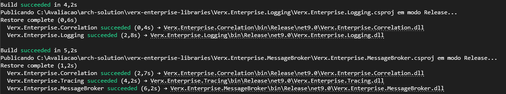

## Considerações Finais

Este projeto representa uma arquitetura moderna, resiliente e bem documentada, com forte ênfase em:
- Separação de responsabilidades
- Padrões arquiteturais sólidos
- Observabilidade e rastreabilidade
- Testabilidade e automação